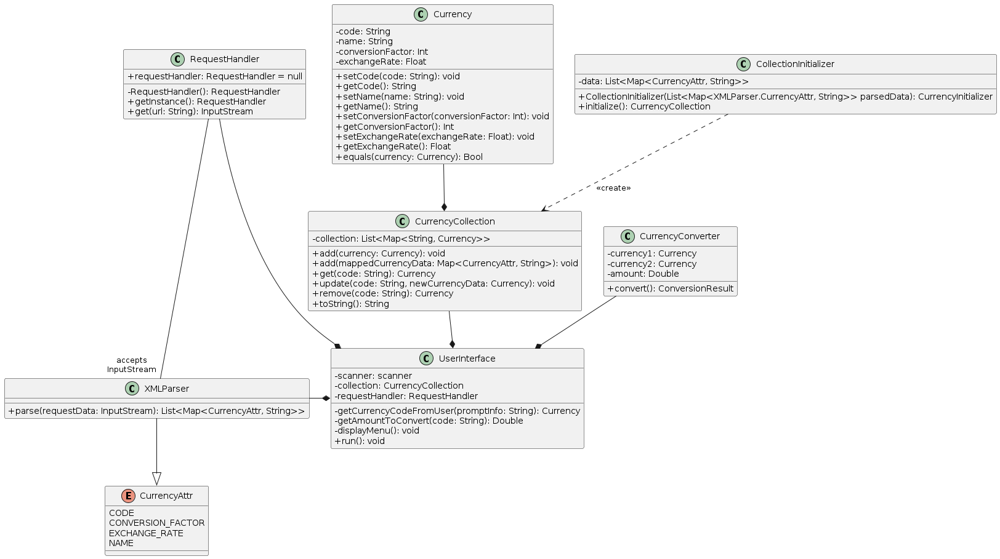

# LAB - 1

## Assignment Description

Narodowy Bank Polski publikuje w witrynie https://www.nbp.pl/kursy/xml/lasta.xml tabelę średnich kursów walut.

Zaprojektować narzędzie umożliwiające obliczenie wartości końcowej kwoty w dowolnej walucie docelowej po podaniu przez użytkownika dowolnej ilości środka pieniężnego dowolnej waluty źródłowej.

### UWAGI

+ Dokonać dekompozycji problemu
+ Uwzględnić relacje między klasami w szczególności całość - część
+ Opracować architekturę rozwiązania
+ Uwzględnić zasady SOLID
+ Wykorzystać singleton

## Program Description

Program ma na celu umożliwienie użytkownikowi obliczenia wartości końcowej kwoty w dowolnej walucie docelowej po podaniu przez użytkownika dowolnej ilości środka pieniężnego dowolnej waluty źródłowej. Aby to osiągnąć, program pobiera tabelę średnich kursów walut z witryny Narodowego Banku Polskiego, a następnie umożliwia użytkownikowi wybór waluty źródłowej i docelowej oraz wprowadzenie kwoty do przeliczenia.

Program składa się z kilku klas, w tym Currency, CurrencyCollection, ConversionResult, CurrencyConverter, RequestHandler, XMLParser, CollectionInitializer i UserInterface. Klasa Currency reprezentuje walutę i przechowuje jej kod, nazwę, współczynnik konwersji i kurs wymiany. Klasa CurrencyCollection przechowuje kolekcję walut i umożliwia dodawanie, usuwanie i aktualizowanie walut. Klasa ConversionResult przechowuje wynik konwersji walutowej. Klasa CurrencyConverter przeprowadza konwersję walutową na podstawie wybranej waluty źródłowej i docelowej oraz kwoty do przeliczenia. Klasa RequestHandler obsługuje żądania HTTP, a klasa XMLParser parsuje dane XML. Klasa CollectionInitializer inicjuje kolekcję walut na podstawie danych pobranych z witryny Narodowego Banku Polskiego. Klasa UserInterface obsługuje interakcję z użytkownikiem i umożliwia wybór waluty źródłowej i docelowej oraz wprowadzenie kwoty do przeliczenia. 

Program wykorzystuje wzorzec Singleton do klasy RequestHandler, aby zapewnić, że tylko jedna instancja klasy jest tworzona podczas działania programu.

## UML Diagram

